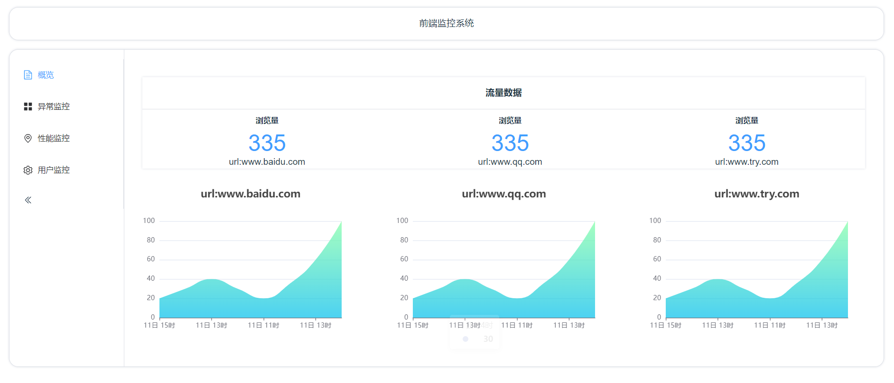
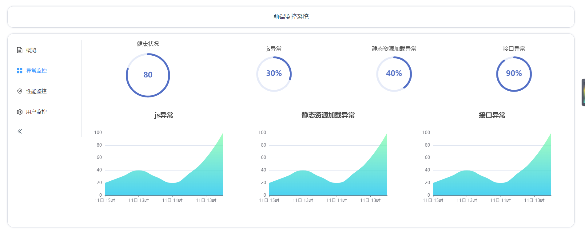
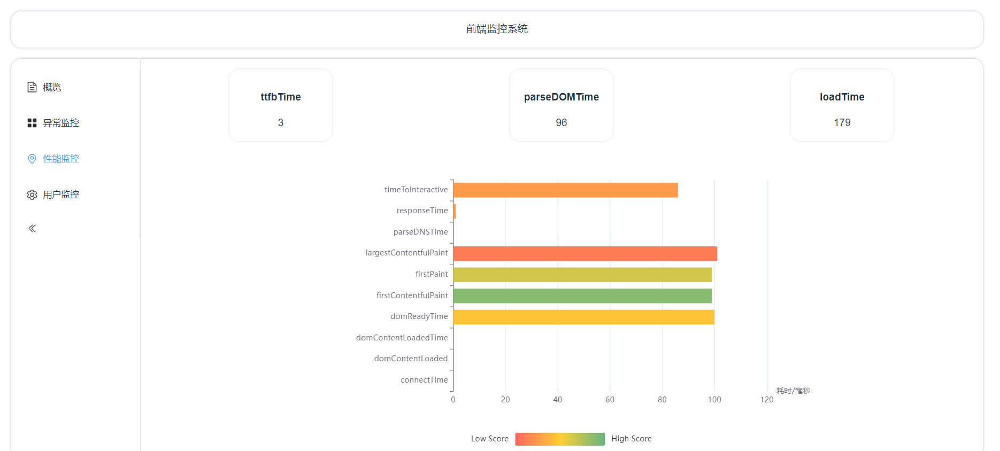
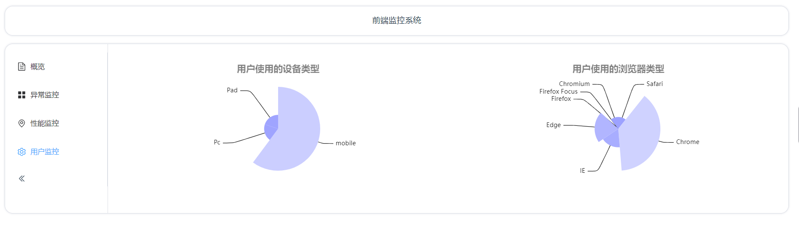

# 项目功能
后台监控管理页面，展示监控情况

# 安装步骤
```
git clone https://github.com/xiaobaigogo/monitor-admin.git
npm install
node server.js // 暂未与后端联调，展示的是mock数据
npm run dev
```

# 项目截图
## 概览


## 异常监控


## 性能监控


## 用户监控

